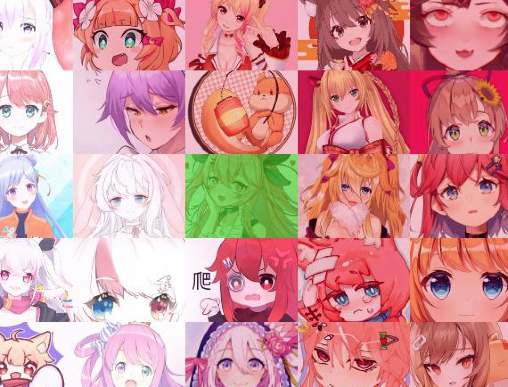

# ddsuki
用于在那张vup大图中找到自己

虽然不太准但勉强能用

谨以此代码向显微镜发明家列文虎克致敬（。

使用方法
-----
1、安装依赖：

```shell
pip install opencv-python
pip install Pillow
pip install requests
```

2、修改脚本中```avatar_url```为你想要找的vup的头像地址

3、运行
```shell
python main.py
```

4、打开生成的layout.jpg，相似的图都覆盖了一层绿色，手动挑选


原理
----
dHash 差异哈希算法，计算两个图片的汉明距离

其他问题
----
如果```layout_cnt=20```还找不到……就继续增加好啦~